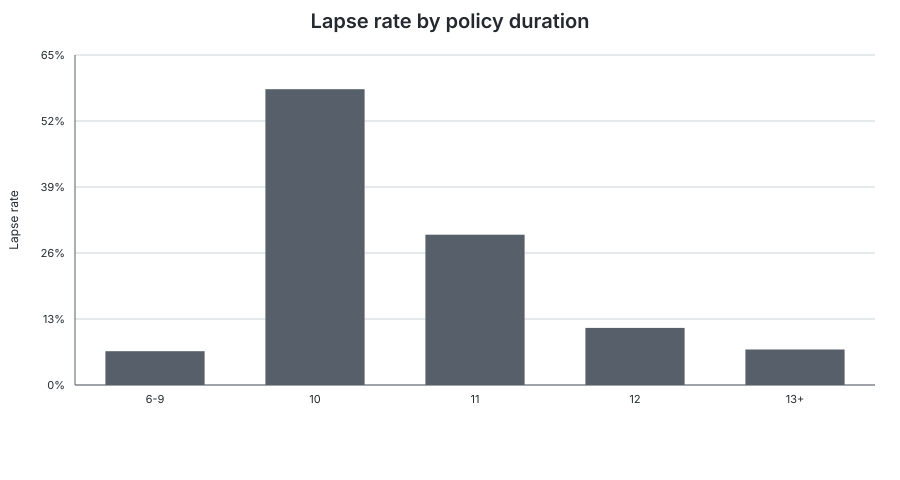
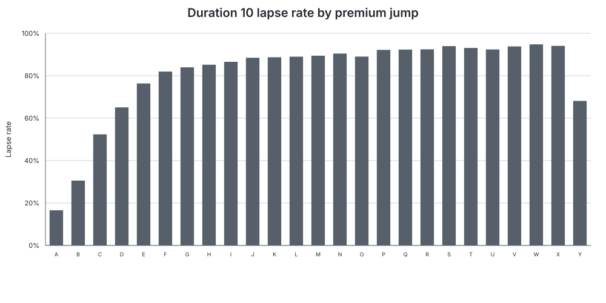
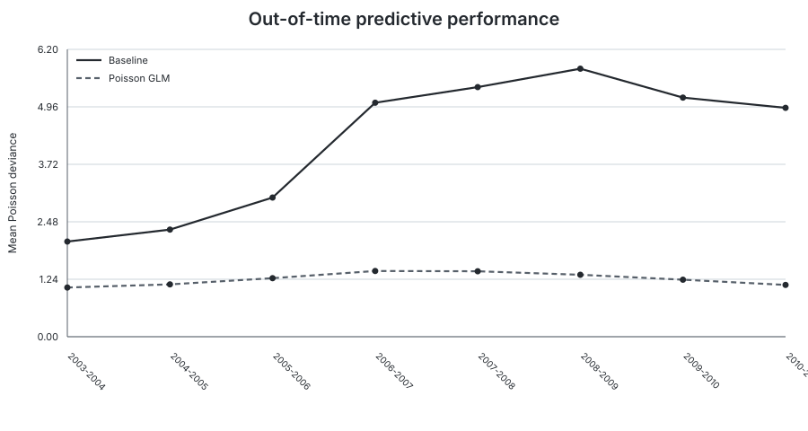
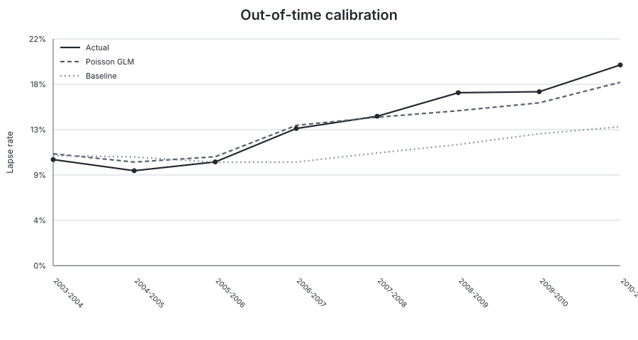

# Life Insurance Lapse Rate Modelling

Actuarial data-science case study of post-level-term lapse behaviour using a **Poisson GLM with policy-count exposure**, explicit rate relativities, expanding-window temporal validation, and a reserved final holdout.

**Data source:** Society of Actuaries — *2014 Post-Level Term Lapse and Mortality Study*  
**Implementation:** Python · pandas · NumPy · statsmodels · scikit-learn · Matplotlib

## Project objective

The project models the number of observed lapses in an aggregated insurance risk cell while accounting for the amount of policy exposure in that cell.

For risk cell \(i\):

\[
L_i \mid X_i \sim \operatorname{Poisson}(E_i\lambda_i)
\]

with log exposure offset

\[
\log \mathbb{E}[L_i\mid X_i]
=
\log E_i + \beta_0 + X_i^\top\beta.
\]

The resulting coefficients can be interpreted actuarially as multiplicative **rate relativities** through \(\exp(\beta)\).

## Headline results

| Metric | Temporal validation | Final holdout 2011-2012 |
|---|---:|---:|
| GLM Poisson deviance | **1.247** | **1.106** |
| Baseline Poisson deviance | 4.210 | 5.370 |
| Improvement vs baseline | **66.7%** | **79.4%** |
| Actual / Predicted | 1.037 | 1.063 |
| Calibration error | +0.52 p.p. | +1.26 p.p. |

The model materially outperforms a simple portfolio-rate baseline in every temporal validation fold and retains strong relative predictive performance on the final holdout. The main weakness is a gradual **temporal calibration drift toward underprediction** in later study years.

## Data

The project uses the lapse component of the **Society of Actuaries 2014 Post-Level Term Lapse and Mortality Study**.

Official SOA study page:  
https://www.soa.org/resources/experience-studies/2014/research-2014-post-level-shock/

The SOA page provides the original study report and a ZIP archive containing the Excel workbooks used for custom analysis of the study data.

The local lapse dataset was reconstructed from the Excel Pivot Cache and saved as `soa_post_level_term_lapse.csv`.

- source risk cells: **345,627**
- study variables: **17**
- positive-exposure modelling cells: **344,725**
- total policy-count exposure: approximately **6.73 million policy-years**
- observed lapses: approximately **1.01 million**

Each row is an **aggregated risk cell**, not an individual insurance policy.

The reconstructed CSV is intentionally **not redistributed in this repository**. See [`data/README.md`](data/README.md) for the data-source and local-file convention.

## 1. Data Preparation & EDA

The strongest portfolio pattern is the well-known post-level-term lapse shock around the end of the guaranteed level-premium period.

Observed lapse rates by policy duration are approximately:

| Duration | Lapse rate |
|---|---:|
| 6-9 | 6.65% |
| 10 | **58.26%** |
| 11 | 29.60% |
| 12 | 11.24% |
| 13+ | 7.00% |



At duration 10, lapse behaviour also varies strongly with the size of the premium increase from duration 10 to 11. Small jumps show materially lower lapse rates, while several larger jump bands exceed 80%.



A supporting view of the portfolio trend across study years is available in [`figures/05_portfolio_lapse_rate_by_study_year.svg`](figures/05_portfolio_lapse_rate_by_study_year.svg).

## 2. Model Development

The final model uses eight categorical predictors:

```python
predictors = [
    "DURATION",
    "GENDER",
    "ISSUE_AGE_GROUP",
    "FACE_AMOUNT_BAND",
    "POST_LEVEL_PREMIUM_STRUCTURE",
    "PREM_JUMP_D11_D10",
    "RISK_CLASS",
    "PREMIUM_MODE",
]
```

`ISSUE_YEAR_GROUP` was deliberately removed from the final specification because new issue cohorts emerge over time and can first appear with material exposure in future temporal folds. Retaining it would make the encoding structure intrinsically unstable for genuine future prediction.

Categorical variables are one-hot encoded with explicit actuarial reference categories. Residual unseen levels are handled with `handle_unknown="ignore"`.

### Temporal design

Development period:

```text
2000-2001 ... 2010-2011
```

Reserved final holdout:

```text
2011-2012
```

Model selection and performance assessment use an **8-fold expanding-window temporal validation**. Each model is trained only on study years preceding its validation year.

The comparison baseline is the aggregate lapse rate observed in the corresponding training window.

## 3. Temporal Validation

The GLM beats the portfolio-rate baseline in all eight future validation years.

| Metric | Mean | Std. dev. | Min | Max |
|---|---:|---:|---:|---:|
| Baseline Poisson deviance | 4.210 | 1.498 | 2.053 | 5.783 |
| GLM Poisson deviance | **1.247** | 0.137 | 1.062 | 1.419 |
| Improvement | **66.7%** | 12.2 p.p. | 48.3% | 77.4% |



The detailed fold results are available in [`tables/temporal_validation_folds.csv`](tables/temporal_validation_folds.csv).

### Calibration

Across pooled out-of-fold predictions:

- actual lapse rate: **14.63%**
- GLM predicted lapse rate: **14.11%**
- baseline predicted rate: **11.47%**
- Actual / Predicted: **1.037**
- calibration error: **+0.52 percentage points**

Early validation years are mildly overpredicted. Later years move in the opposite direction and the GLM begins to underpredict the absolute lapse level, even though relative deviance performance remains strong.



The full yearly calibration series is available in [`tables/calibration_by_year.csv`](tables/calibration_by_year.csv).

## 4. Interpretation

`DURATION` is the dominant model driver. Relative to duration 6-9, the fitted rate relativities are approximately:

| Duration | Rate relativity |
|---|---:|
| 10 | **8.69×** |
| 11 | 5.75× |
| 12 | 2.48× |
| 13+ | 1.77× |

The duration-10 lapse shock therefore remains dominant even after simultaneously controlling for the other rating factors.

`PREM_JUMP_D11_D10` is another strong driver: larger premium jumps are associated with materially higher fitted lapse rates.

For premium structure, **Premium Jump to Other** has a fitted rate relativity of approximately **0.56×** relative to **Premium Jump to ART**, holding the remaining model factors constant.

Selected published relativities are stored in [`tables/glm_rate_relativities.csv`](tables/glm_rate_relativities.csv); the notebook regenerates the complete coefficient table.

## 5. Final Holdout Evaluation

After temporal development is complete, the encoder and GLM are refit on all development years and evaluated once on study year **2011-2012**.

The final development fit contains **298,396 risk cells**. The reserved holdout contains **46,329 risk cells**.

| Metric | Final holdout 2011-2012 |
|---|---:|
| Baseline Poisson deviance | 5.370 |
| GLM Poisson deviance | **1.106** |
| Improvement vs baseline | **79.4%** |
| Actual lapse rate | 21.32% |
| GLM predicted lapse rate | 20.06% |
| Actual / Predicted | 1.063 |
| Calibration error | +1.26 p.p. |

The holdout confirms both central findings of the project: strong relative predictive performance and a later-period drift toward underprediction.

## 6. Final Assessment & Limitations

The final result is internally consistent across temporal validation and the reserved holdout:

- the Poisson GLM consistently and materially outperforms the portfolio-rate baseline;
- predictive performance measured by Poisson deviance is temporally stable;
- the major actuarial drivers are interpretable and consistent with post-level-term lapse mechanics;
- the primary weakness is **absolute calibration drift**, not a collapse in relative predictive performance.

Limitations:

- the dataset is aggregated at risk-cell level rather than individual-policy level;
- the model assumes a Poisson mean-variance structure and a log-linear predictor;
- categorical effects are represented by fixed rate relativities and interactions are not modelled explicitly;
- categorical levels can first appear in future years;
- the historical SOA study is not a current production portfolio, so transfer to another portfolio would require fresh validation and calibration.

If deployed in practice, monitoring should focus on aggregate Actual / Predicted, calibration error, Poisson deviance against a simple baseline, stability of key categorical effects, and changes in exposure mix. Given the observed pattern, periodic **intercept recalibration** would be a natural first response to a pure level shift before full redevelopment.

## Repository structure

```text
life-insurance-lapse-rate-modelling/
├── README.md
├── life_insurance_lapse_rate_modelling_clean.ipynb
├── requirements.txt
├── .gitignore
├── data/
│   └── README.md
├── figures/
│   ├── 01_lapse_rate_by_duration.svg
│   ├── 02_duration10_lapse_rate_by_premium_jump.svg
│   ├── 03_temporal_validation_deviance.svg
│   ├── 04_temporal_validation_calibration.svg
│   └── 05_portfolio_lapse_rate_by_study_year.svg
└── tables/
    ├── final_results_summary.csv
    ├── final_results_summary.md
    ├── temporal_validation_folds.csv
    ├── temporal_stability_summary.csv
    ├── calibration_by_year.csv
    ├── glm_rate_relativities.csv
    ├── oof_calibration_summary.csv
    └── final_holdout_summary.csv
```

## Reproducibility

Create an environment and install the minimal dependencies:

```bash
python -m venv .venv
# activate the environment for your operating system
pip install -r requirements.txt
```

Place `soa_post_level_term_lapse.csv` in the repository root and run:

```text
life_insurance_lapse_rate_modelling_clean.ipynb
```

The notebook contains the complete workflow from loading the reconstructed study data through temporal validation, model interpretation, and the final holdout evaluation.
