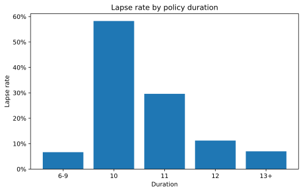
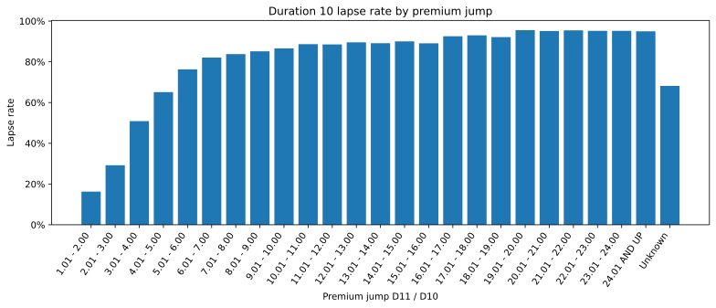
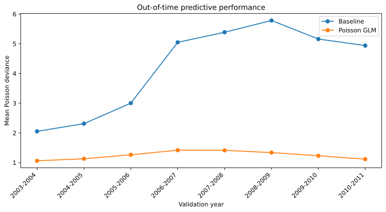
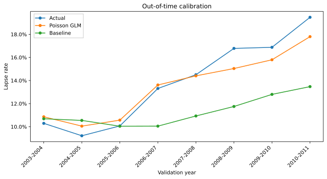

# Life Insurance Lapse Rate Modelling

Actuarial data-science case study of post-level-term lapse behaviour using a **Poisson GLM with policy-count exposure**, explicit rate relativities, expanding-window temporal validation, and a reserved final holdout.

**Data source:** Society of Actuaries — *2014 Post-Level Term Lapse and Mortality Study*  
**Implementation:** Python · pandas · NumPy · statsmodels · scikit-learn · Matplotlib

## Project objective

The project models observed lapse counts in aggregated insurance risk cells while explicitly accounting for policy-count exposure.

For risk cell \(i\):

\[
L_i \mid X_i \sim \operatorname{Poisson}(E_i\lambda_i),
\]

with log exposure offset

\[
\log \mathbb{E}[L_i\mid X_i] = \log E_i + \beta_0 + X_i^\top\beta.
\]

The fitted categorical effects are therefore interpretable as multiplicative **rate relativities** through \(\exp(\beta)\).

## Headline results

| Metric | Temporal validation | Final holdout 2011-2012 |
|:--|--:|--:|
| GLM Poisson deviance | **1.247** | **1.106** |
| Baseline Poisson deviance | 4.210 | 5.370 |
| Improvement vs baseline | **66.7%** | **79.4%** |
| Actual / Predicted | 1.037 | 1.063 |
| Calibration error | +0.52 p.p. | +1.26 p.p. |

The Poisson GLM materially outperforms the portfolio-rate baseline in every temporal validation fold and retains strong relative predictive performance on the untouched final holdout. The main weakness is a gradual **temporal calibration drift toward underprediction** in later study years.

Exact headline values: [`tables/core/final_results_summary.csv`](tables/core/final_results_summary.csv).

## Data

The project uses the lapse component of the **Society of Actuaries 2014 Post-Level Term Lapse and Mortality Study**.

Official SOA study page:  
https://www.soa.org/resources/experience-studies/2014/research-2014-post-level-shock/

The local lapse dataset was reconstructed from the Excel Pivot Cache and saved as `soa_post_level_term_lapse.csv`.

- source risk cells: **345,627**
- study variables: **17**
- positive-exposure modelling cells: **344,725**
- total policy-count exposure: approximately **6.73 million policy-years**
- observed lapses: approximately **1.01 million**

Each row is an **aggregated risk cell**, not an individual policy. The reconstructed CSV is intentionally **not redistributed in this repository**. See [`data/README.md`](data/README.md).

## 1. Data Preparation & EDA

The strongest portfolio pattern is the post-level-term lapse shock around the end of the guaranteed level-premium period.

| Duration | Lapse rate |
|:--|--:|
| 6-9 | 6.65% |
| 10 | **58.26%** |
| 11 | 29.60% |
| 12 | 11.24% |
| 13+ | 7.00% |



Underlying values: [`tables/supporting/lapse_rate_by_duration.csv`](tables/supporting/lapse_rate_by_duration.csv).

At duration 10, lapse behaviour varies strongly with the premium increase from duration 10 to 11. Small jumps show materially lower lapse rates while larger jump bands reach very high lapse rates.



Underlying values: [`tables/supporting/duration10_premium_jump_summary.csv`](tables/supporting/duration10_premium_jump_summary.csv).

The study-year portfolio trend is retained as a supporting output: [`figures/supporting/05_portfolio_lapse_rate_by_study_year.svg`](figures/supporting/05_portfolio_lapse_rate_by_study_year.svg), with data in [`tables/supporting/lapse_rate_by_study_year.csv`](tables/supporting/lapse_rate_by_study_year.csv).

## 2. Model Development

The final model uses eight categorical predictors:

```python
predictors = [
    "DURATION",
    "GENDER",
    "ISSUE_AGE_GROUP",
    "FACE_AMOUNT_BAND",
    "POST_LEVEL_PREMIUM_STRUCTURE",
    "PREM_JUMP_D11_D10",
    "RISK_CLASS",
    "PREMIUM_MODE",
]
```

`ISSUE_YEAR_GROUP` was removed from the final specification because new issue cohorts emerge over time and can first appear with material exposure in future temporal folds. Categorical variables are one-hot encoded with explicit actuarial reference categories; residual unseen levels are handled with `handle_unknown="ignore"`.

### Temporal design

- **Development:** 2000-2001 through 2010-2011
- **Final untouched holdout:** 2011-2012
- **Validation:** 8-fold expanding-window temporal validation

Each fold is trained only on study years preceding its validation year. The baseline is the aggregate lapse rate observed in the corresponding training window.

## 3. Temporal Validation

The GLM beats the baseline in all eight future validation years.

| Metric | Mean | Std. dev. | Min | Max |
|:--|--:|--:|--:|--:|
| Baseline Poisson deviance | 4.210 | 1.498 | 2.053 | 5.783 |
| GLM Poisson deviance | **1.247** | 0.137 | 1.062 | 1.419 |
| Improvement | **66.7%** | 12.2 p.p. | 48.3% | 77.4% |



Detailed outputs:
- [`tables/core/temporal_validation_folds.csv`](tables/core/temporal_validation_folds.csv)
- [`tables/core/temporal_stability_summary.csv`](tables/core/temporal_stability_summary.csv)

### Calibration

Across pooled out-of-fold predictions:

- actual lapse rate: **14.63%**
- GLM predicted lapse rate: **14.11%**
- baseline predicted rate: **11.47%**
- Actual / Predicted: **1.037**
- calibration error: **+0.52 percentage points**

Early validation years are mildly overpredicted. Later years move in the opposite direction and the GLM begins to underpredict the absolute lapse level, even though relative deviance performance remains strong.



Detailed outputs:
- [`tables/core/calibration_by_year.csv`](tables/core/calibration_by_year.csv)
- [`tables/core/oof_calibration_summary.csv`](tables/core/oof_calibration_summary.csv)

## 4. Interpretation

`DURATION` is the dominant model driver. Relative to duration 6-9:

| Duration | Rate relativity |
|:--|--:|
| 10 | **8.69×** |
| 11 | 5.75× |
| 12 | 2.48× |
| 13+ | 1.77× |

`PREM_JUMP_D11_D10` is another strong driver. For premium structure, **Premium Jump to Other** has a fitted rate relativity of approximately **0.56×** relative to **Premium Jump to ART**, holding the remaining model factors constant.

The final export contains the **complete** coefficient / rate-relativity table:
- [`tables/core/glm_rate_relativities.csv`](tables/core/glm_rate_relativities.csv)
- [`tables/core/glm_rate_relativities.md`](tables/core/glm_rate_relativities.md)

## 5. Final Holdout Evaluation

After temporal development, the encoder and GLM are refit on all development years and evaluated once on **2011-2012**.

- development fit: **298,396 risk cells**
- reserved holdout: **46,329 risk cells**

| Metric | Final holdout 2011-2012 |
|:--|--:|
| Baseline Poisson deviance | 5.370 |
| GLM Poisson deviance | **1.106** |
| Improvement vs baseline | **79.4%** |
| Actual lapse rate | 21.32% |
| GLM predicted lapse rate | 20.06% |
| Actual / Predicted | 1.063 |
| Calibration error | +1.26 p.p. |

Exact holdout metrics: [`tables/core/final_holdout_summary.csv`](tables/core/final_holdout_summary.csv).

The holdout confirms both central findings: strong relative predictive performance and later-period drift toward underprediction.

## 6. Final Assessment & Limitations

The final result is internally consistent across temporal validation and the reserved holdout:

- the Poisson GLM consistently and materially outperforms the portfolio-rate baseline;
- predictive performance measured by Poisson deviance is temporally stable;
- the major actuarial drivers are interpretable and consistent with post-level-term lapse mechanics;
- the primary weakness is **absolute calibration drift**, not a collapse in relative predictive performance.

Limitations include aggregated rather than individual-policy data, the Poisson mean-variance assumption, fixed categorical rate relativities without explicit interactions, future emergence of categorical levels, and the historical nature of the SOA study.

For practical monitoring, the natural diagnostics are aggregate Actual / Predicted, calibration error, Poisson deviance against a simple baseline, stability of key categorical effects, and exposure-mix changes. A pure level shift would naturally suggest **intercept recalibration** before full redevelopment.

## Repository structure

The presentation layer follows the final export package: **core** and **supporting** assets are separated, numeric outputs are retained as CSV, and Markdown table variants are provided for direct GitHub reuse.

```text
life-insurance-lapse-rate-modelling/
├── README.md
├── MANIFEST.md
├── life_insurance_lapse_rate_modelling_clean.ipynb
├── requirements.txt
├── .gitignore
├── data/
│   └── README.md
├── figures/
│   ├── core/
│   │   ├── 01_lapse_rate_by_duration.svg
│   │   ├── 02_duration10_lapse_rate_by_premium_jump.svg
│   │   ├── 03_temporal_validation_deviance.svg
│   │   └── 04_temporal_validation_calibration.svg
│   └── supporting/
│       └── 05_portfolio_lapse_rate_by_study_year.svg
└── tables/
    ├── core/
    │   ├── final_results_summary.{csv,md}
    │   ├── final_results_summary_readme.md
    │   ├── temporal_validation_folds.{csv,md}
    │   ├── temporal_stability_summary.{csv,md}
    │   ├── calibration_by_year.{csv,md}
    │   ├── glm_rate_relativities.{csv,md}
    │   ├── oof_calibration_summary.{csv,md}
    │   └── final_holdout_summary.{csv,md}
    └── supporting/
        ├── lapse_rate_by_study_year.{csv,md}
        ├── lapse_rate_by_duration.{csv,md}
        └── duration10_premium_jump_summary.{csv,md}
```

The supplied export bundle contains both PNG and SVG figure variants. The repository keeps the SVG variants for scalable GitHub rendering without duplicating the same charts as binary PNGs; the PNG exports remain suitable for the later web-portfolio stage.

See [`MANIFEST.md`](MANIFEST.md) for the core/supporting classification.

## Reproducibility

Create an environment and install the minimal dependencies:

```bash
python -m venv .venv
# activate the environment for your operating system
pip install -r requirements.txt
```

Place `soa_post_level_term_lapse.csv` in the repository root and run:

```text
life_insurance_lapse_rate_modelling_clean.ipynb
```

The notebook contains the complete workflow from loading the reconstructed study data through temporal validation, model interpretation, and the final holdout evaluation.
